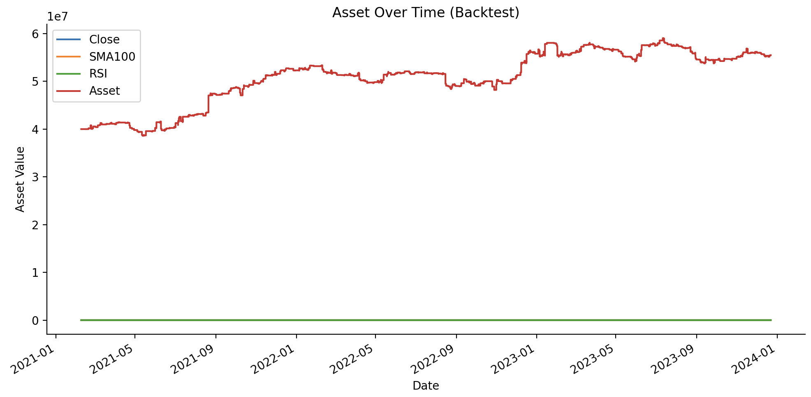
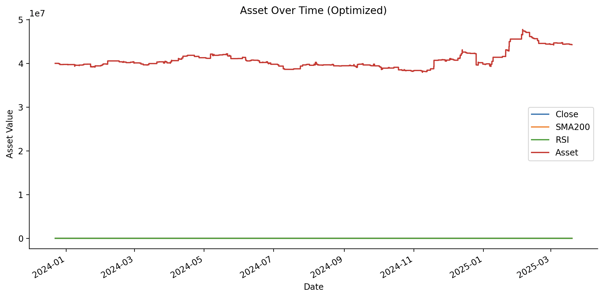

## Abstract

This project implements a hybrid trading strategy on the VN30F1M futures index using the Simple Moving Average (SMA-100) and the Relative Strength Index (RSI-14). The strategy aims to capture mean-reversion signals that occur when RSI reaches extreme levels (overbought/oversold) against the prevailing SMA trend. We backtest the strategy using data from Algotrade, evaluating performance through returns, Sharpe ratio, and drawdown. Results suggest the approach can yield consistent returns under specific market conditions.

---

## 1. Introduction

Algorithmic trading has become an essential component of modern financial markets, allowing traders to implement and automate strategies based on well-defined rules and quantitative signals. Among the various classes of strategies, mean-reversion and momentum-based approaches are two fundamental techniques widely used by both retail and institutional traders.

This project focuses on applying a hybrid mean-reversion and momentum strategy to the VN30F1M futures index, one of the most liquid and volatile derivatives instruments in the Vietnamese market. The strategy is built on two core technical indicators:

- Simple Moving Average (SMA) with a 100-period window is used to capture the long-term trend direction.
- The Relative Strength Index (RSI) with a 14-period window is employed to identify short-term overbought and oversold conditions.

---

## 2. Trading (Algorithm) Hypotheses

When the Relative Strength Index (RSI) indicates oversold or overbought conditions and aligns with the broader trend confirmed by a slower-moving average, prices are likely to revert to their mean. This creates opportunities to trade counter to short-term extremes while respecting the dominant trend.

---

## 3. Data

- Data source: Algotrade Internship Database
- Data type: CSV
- Data period:
  - In-sample data: 2021-02-08 to 2023-12-22
  - Out-sample data: 2023-12-22 to 2025-03-19
- To get the input data:
  - Option 1: Download [data](https://drive.google.com/drive/folders/1bK3aXEVfabASZs2xV8VBXYA0mXjQtB-A?usp=sharing) from google drive, extract these files into `data` folder
  - Option 2: Use this script at project folder to get data (please wait for a few minutes ^^):
  ```bash
  python -m src.data
  ```
- If you use option 2, `in_sample_data.csv` and `out_sample_data.csv` is stored at `data` folder

### Data collection

The price of VN30F1M are collected from Algotrade database using SQL queries, then was pre-processed and used for this project.

### Data processing

Raw data was first cleaned by removing all records before 9:00 AM. Timestamps were rounded down to the nearest minute, and only the first record of each minute was retained to reduce noise. Column names were standardized, keeping only the essential fields: timestamp, ticker symbol, and closing price. The final dataset was then split into two sets: In-sample (70%) and Out-sample (30%), ensuring there was no overlap in timestamps between the two sets.

---

## 4. Implementation Guide

Follow the steps below to get the project up and running locally.

### 1. Clone this Repository

```bash
git clone "https://github.com/thachnhb/group9.git"
```

### 2. Create Environment

#### 2.1. Move into the project directory

```bash
   cd <repo>
```

#### 2.2 Create the virtual environment

```bash
   python -m venv venv
```

#### 2.3 Activate the virtual environment (Kích hoạt môi trường ảo):

```bash
.\venv\Scripts\activate (For Windows)
```

or

```bash
source venv/bin/activate (For MacOS/Linux)
```

### 3. Install required libraries from requirement.txt

```bash
pip install -r requirements.txt
```

---

## 5. In-sample Backtesting

To start backtest, run this command:

```bash
python -m src.backtest
```

### Parameters

| Parameter    | Description                       | Default Value |
| ------------ | --------------------------------- | ------------- |
| `sma_window` | calculate a Simple Moving Average | 100           |
| `rsi_lower`  | The buy threshold                 | 25            |
| `rsi_upper`  | The sell thresold                 | 75            |

### In-sample Backtesting Result

- 

```bash
Final Asset Value: 55475000.0000002
  Sharpe Ratio: 0.7217
  Maximum Drawdown: -9.66%
  Accumulated return rate: 0.3869
```

---

## 6. Optimization

#### Optimization Method

The optimization uses Optuna's TPE Sampler (Tree-structured Parzen Estimator).

The goal is to maximize the final asset value at the end of the trading period.

The process automatically explores parameter combinations and records their performance, helping find the most profitable strategy.

#### Parameters to Optimize

| Parameter    | Description                       | Search space                |
| ------------ | --------------------------------- | --------------------------- |
| `sma_window` | calculate a Simple Moving Average | Integer from `50` to `200`  |
| `rsi_lower`  | The buy threshold                 | Float from `20.0` to `35.0` |
| `rsi_upper`  | The sell thresold                 | Float from `65.0` to `80.0` |

#### Hyperparameters of the Optimization Process

| Hyperparameter | Description                                                     | Value                    |
| -------------- | --------------------------------------------------------------- | ------------------------ |
| `n_trials`     | Number of optimization trials to explore parameter combinations | `80` (default in script) |
| `seed`         | Random seed for reproducibility of results.                     | `710` (used in example)  |
| `sampler`      | Sampling algorithm used to suggest new parameter values.        | `TPESampler`             |

To run optimize for In-sample data, use this command:

```bash
python -m src.optimize
```

#### In-sample Optimization Result


After run above In-sample Optimization, we get below params:
| Parameter | Description | Default Value |
| ---------- | --------------------------------- | ------------------ |
| sma_window | calculate a Simple Moving Average | 200 |
| rsi_lower | The buy threshold | 29.140662837219445 |
| rsi_upper | The sell thresold | 65.00361398539523 |

### Apply params of Optimization for Out-of-sample Backtesting

To run Backtesting with best params from Optimize for Out-Sample, we use this command:

```bash
python -m src.backtest --use-optimized
```

Then, we get below result:


#### Out-of-sample Optimization Result (Optional)

- 

## Conclusion

- The backtesting results reveal a significant discrepancy between the in-sample and out-sample performance of the strategy, despite using the same optimized parameters. While the in-sample phase showed strong profit growth, the out-sample test suffered from both negative returns and high drawdowns, suggesting potential overfitting to historical data rather than genuine robustness.

- Additionally, during further testing with conventional parameters (SMA window = 100, RSI 30/70), the asset curve flattened for a large part of the period. This indicates that the strategy’s signal conditions were either too restrictive or the market conditions did not trigger any trades for extended periods. Such behavior highlights that the strategy's logic may have low adaptability and high sensitivity to parameter settings, especially in varying market environments.

- In summary, the current algorithm exhibits signs of overfitting and structural fragility. Further review is recommended to:

- Reconsider entry/exit rules to avoid dead zones.

- Allow more dynamic thresholds.

- Add market regime detection or parameter stability testing before deployment.

## Reference
